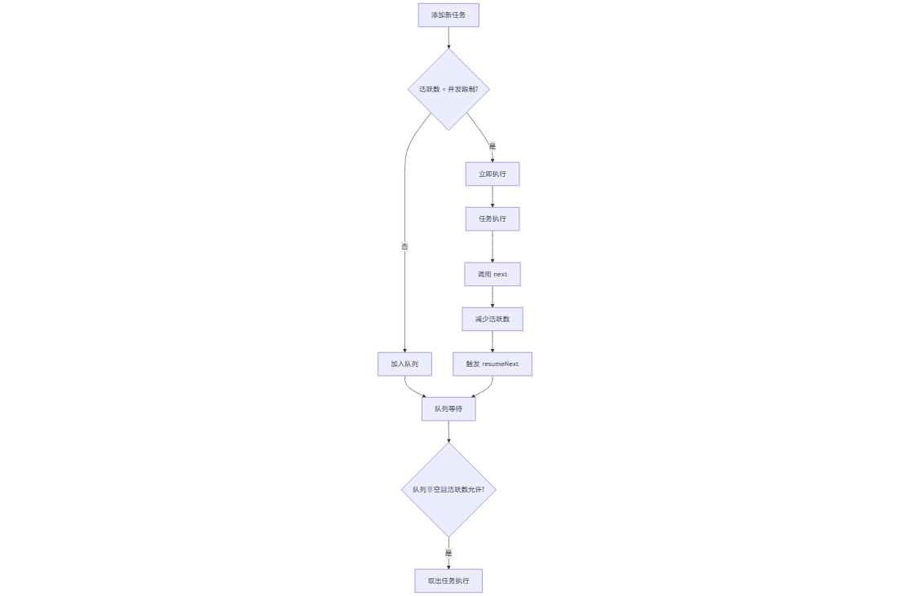

# 前端优质源码

| 序号 | 名称                                                | 描述                      |
| :--: | :-------------------------------------------------- | :------------------------ |
|  01  | [arrify](#arrify)                                   | 将各种类型转换为数组      |
|  02  | [yocto-queue](#yocto-queue)                         | 轻量级链表队列实现        |
|  03  | [Vue2 工具函数](#vue2-源码方法)                     | Vue2 常用工具方法集合     |
|  04  | [axios 工具函数](#axios)                            | axios 请求库工具函数      |
|  05  | [await-to-js](#await-to-js)                         | 优雅处理 async/await 错误 |
|  06  | [promisify](#promisify)                             | 回调函数转 Promise        |
|  07  | [underscore](#underscore-防抖)                      | 函数防抖实现              |
|  08  | [mitt,、tiny-emitter](#mitt、tiny-emitter-发布订阅) | 极简事件发布订阅          |
|  09  | [p-limit](#p-limit-限制并发数)                      | Promise 并发控制          |
|  10  | [classNames](#classnames)                           | 类名拼接工具              |
|  11  | [koa-compose](#koa-compose-洋葱模型)                | 洋葱模型                  |
|  12  | [element](#element-新建组件)                        | element 新建组件          |
|  13  | [tdesign-vue](#tdesign-vue)                         | tdesign-vue 初始化组件    |
|  14  | [Vue 发布](#vue-release)                            | vuejs 发布流程            |
|  15  | [element-plus message](#element-plus-message)       | element-plus message 组件 |
|  16  | [js-cookie](#js-cookie)                             | Cookie 管理解决方案       |
|  17  | [only-allow](#only-allow)                           | 统一规范团队包管理器      |
|  18  | [Vue2/3 响应式](#vue-reactive)                      | Vue2 / Vue3 响应式原理    |

## arrify

https://github.com/sindresorhus/arrify

### 迭代器协议的核心 ​

1. Symbol.iterator 是一个预定义的 Symbol 值，用于定义对象的默认迭代器。任何实现了 [Symbol.iterator]() 方法的对象都被称为 ​ 可迭代对象 ​（Iterable）。该方法必须返回一个 ​ 迭代器对象 ​（Iterator），迭代器对象需实现 next() 方法，返回 { value: any, done: boolean } 的结构。

2. 迭代过程解析 ​
   - 当对可迭代对象使用 for...of 或展开运算符 ... 时，会隐式调用 [Symbol.iterator]() 获取迭代器。
   - 每次调用迭代器的 next() 方法，指针会移动到下一个元素，直到 done: true

### Symbol.iterator 的应用场景

1. 内置可迭代对象

- 数组、字符串、Map、Set​ 等原生支持迭代：

```js
const arr = [1, 2, 3]
const iterator = arr[Symbol.iterator]()
console.log(iterator.next()) // { value: 1, done: false }[1](@ref)
```

- ​ 字符串的字符遍历：

```js
const str = 'hi'
for (const char of str) {
  /* 依次输出 'h', 'i' */
}
```

2. 自定义迭代器

通过实现 [Symbol.iterator]() 方法，可以让普通对象支持迭代：

```js
const obj = {
  data: [10, 20, 30],
  [Symbol.iterator]() {
    let index = 0
    return {
      next: () => ({
        value: this.data[index++],
        done: index > this.data.length,
      }),
    }
  },
}
for (const num of obj) {
  /* 输出 10, 20, 30 */
}
```

3. 生成器函数

生成器函数（function\*）会自动返回迭代器，yield 控制暂停和恢复：

```js
function* gen() {
  yield 1
  yield 2
}
const it = gen()
console.log(it.next()) // { value: 1, done: false }
```

### 代码中 Symbol.iterator 的关键作用

```js
export default function arrify(value) {
  if (value === null || value === undefined) {
    return []
  }

  if (Array.isArray(value)) {
    return value
  }

  if (typeof value === 'string') {
    return [value]
  }

  if (typeof value[Symbol.iterator] === 'function') {
    return [...value]
  }

  return [value]
}
```

- ​ 逻辑解析：
  检查传入的 value 是否实现了 Symbol.iterator 方法。若存在，则通过展开运算符 ... 消费迭代器，将可迭代对象转换为数组。
- 兼容性处理：
  这一设计使得函数能处理所有实现了迭代器协议的数据结构，包括：
  内置对象（数组、字符串、Map、Set 等）
  自定义迭代器对象
  生成器函数返回的迭代器

---

## yocto-queue

https://github.com/sindresorhus/yocto-queue

### 队列实现原理

这是一个基于链表实现的轻量级队列数据结构，采用现代 JavaScript 特性，具有高效的性能特点。

### 核心实现

1. 节点结构

```javascript
class Node {
  value // 存储节点的值
  next // 指向下一个节点的引用

  constructor(value) {
    this.value = value
  }
}
```

2. 队列类设计

```javascript
class Queue {
  #head // 队列头部指针
  #tail // 队列尾部指针
  #size // 队列大小计数器
}
```

### 关键方法实现

1. 入队操作（enqueue）

```javascript
enqueue(value) {
    const node = new Node(value);
    if (this.#head) {
        this.#tail.next = node;
        this.#tail = node;
    } else {
        this.#head = node;
        this.#tail = node;
    }
    this.#size++;
}
```

2. 出队操作（dequeue）

```javascript
dequeue() {
    const current = this.#head;
    if (!current) {
        return;
    }
    this.#head = this.#head.next;
    this.#size--;
    return current.value;
}
```

3. 迭代器支持

```javascript
* [Symbol.iterator]() {const queue = new Queue();

// 添加元素
queue.enqueue('任务1');
queue.enqueue('任务2');
queue.enqueue('任务3');

// 获取队列大小
console.log(queue.size);  // 输出: 3

// 查看队首元素
console.log(queue.peek());  // 输出: '任务1'

// 移除并返回队首元素
console.log(queue.dequeue());  // 输出: '任务1'

// 遍历队列
for (const item of queue) {
    console.log(item);  // 依次输出: '任务2', '任务3'
}
    let current = this.#head;
    while (current) {
        yield current.value;
        current = current.next;
    }
}
```

4. 性能优化

- 通过维护尾指针（#tail）避免每次入队时遍历整个链表
- 所有核心操作（入队、出队）都是 O(1) 时间复杂度

### 使用示例

```ts
const queue = new Queue()

// 添加元素
queue.enqueue('任务1')
queue.enqueue('任务2')
queue.enqueue('任务3')

// 获取队列大小
console.log(queue.size) // 输出: 3

// 查看队首元素
console.log(queue.peek()) // 输出: '任务1'

// 移除并返回队首元素
console.log(queue.dequeue()) // 输出: '任务1'

// 遍历队列
for (const item of queue) {
  console.log(item) // 依次输出: '任务2', '任务3'
}
```

### 应用场景

1. 任务队列管理
2. 事件处理系统
3. 消息缓冲处理
4. 广度优先搜索（BFS）
5. 打印任务管理

### 优势特点

1. 使用私有字段（#）确保数据封装
2. 支持迭代器接口，方便遍历
3. 实现简洁，代码易于维护
4. 性能优化，操作效率高
5. 符合 FIFO（先进先出）原则

## Vue2 源码方法

https://github.com/vuejs/vue/blob/dev/dist/vue.js#L14-L379

### 类型检查函数

```js
// 检查值是否为 undefined 或 null
function isUndef(v) {
  return v === null || v === undefined
}
console.log(isUndef(null)) // true
console.log(isUndef(undefined)) // true
console.log(isUndef(0)) // false

// 检查值是否已定义（非 undefined 且非 null）
function isDef(v) {
  return v !== undefined && v !== null
}
console.log(isDef(123)) // true
console.log(isDef('')) // true
console.log(isDef(null)) // false

// 检查值是否为 true
function isTrue(v) {
  return v === true
}
console.log(isTrue(true)) // true
console.log(isTrue(1)) // false

// 检查值是否为 false
function isFalse(v) {
  return v === false
}
console.log(isFalse(false)) // true
console.log(isFalse(0)) // false

// 检查值是否为原始类型（字符串、数字、布尔值或符号）
function isPrimitive(v) {
  return (
    typeof v === 'string' ||
    typeof v === 'number' ||
    typeof v === 'boolean' ||
    typeof v === 'symbol'
  )
}
console.log(isPrimitive(123)) // true
console.log(isPrimitive('hello')) // true
console.log(isPrimitive({})) // false

// 检查值是否为对象（不包括 null）
function isObject(obj) {
  return obj !== null && typeof obj === 'object'
}
console.log(isObject({})) // true
console.log(isObject([])) // true
console.log(isObject(null)) // false
```

### 类型转换与判断

```js
// 获取对象的原始类型字符串
var _toString = Object.prototype.toString
function toRawType(value) {
  return _toString.call(value).slice(8, -1)
}
console.log(toRawType(true)) // 'Boolean'
console.log(toRawType([])) // 'Array'
console.log(toRawType({})) // 'Object'

// 检查是否为普通对象
function isPlainObject(obj) {
  return _toString.call(obj) === '[object Object]'
}
console.log(isPlainObject({ name: 123 })) // true
console.log(isPlainObject([])) // false

// 检查是否为正则表达式
function isRegExp(v) {
  return _toString.call(v) === '[object RegExp]'
}
console.log(isRegExp(/^abc$/)) // true
console.log(isRegExp('abc')) // false

// 检查是否为有效的数组索引
// n >= 0 ：确保值为非负数（因为数组索引不能为负）
// Math.floor(n) === n ：确保值是整数（不能是小数）
// isFinite(val) ：确保值是有限数（不能是 Infinity 或 NaN）
function isValidArrayIndex(val) {
  var n = parseFloat(String(val))
  return n >= 0 && Math.floor(n) === n && isFinite(val)
}
console.log(isValidArrayIndex(3)) // true
console.log(isValidArrayIndex('3')) // true
console.log(isValidArrayIndex(-1)) // false
console.log(isValidArrayIndex(3.5)) // false

// 检查是否为 Promise 对象
function isPromise(val) {
  return (
    isDef(val) &&
    typeof val.then === 'function' &&
    typeof val.catch === 'function'
  )
}
console.log(isPromise(new Promise(() => {}))) // true
console.log(isPromise({ then: () => {}, catch: () => {} })) // true
console.log(isPromise({})) // false
```

### 值转换函数

```js
// 将值转换为字符串
function toString(val) {
  return val == null
    ? ''
    : Array.isArray(val) || (isPlainObject(val) && val.toString === _toString)
    ? JSON.stringify(val, null, 2)
    : String(val)
}
console.log(toString(null)) // ''
console.log(toString([1, 2, 3])) // '[1,2,3]'
console.log(toString(123)) // '123'

// 将字符串转换为数字
function toNumber(val) {
  var n = parseFloat(val)
  return isNaN(n) ? val : n
}
console.log(toNumber('123')) // 123
console.log(toNumber('123px')) // '123px'
```

### 缓存与性能优化

```js
// 检查对象是否拥有自身属性
// 缓存 hasOwnProperty 方法的引用:
//   1. 提高性能：避免每次都查找原型链;
//   2. 防止被覆盖：避免对象自身的 hasOwnProperty 属性干扰
var hasOwnProperty = Object.prototype.hasOwnProperty
function hasOwn(obj, key) {
  // 确保方法在正确的上下文中执行
  return hasOwnProperty.call(obj, key)
}
console.log(hasOwn({ a: 1 }, 'a')) // true
console.log(hasOwn({ a: 1 }, 'toString')) // false

// 创建一个带缓存的函数
function cached(fn) {
  // 创建一个空对象作为缓存容器，使用 Object.create(null) 创建的对象没有原型链，更纯净
  var cache = Object.create(null)

  // 返回一个新函数，这个函数包含缓存逻辑
  return function cachedFn(str) {
    // 检查缓存中是否已有结果
    var hit = cache[str]
    // 如果有缓存就返回缓存值，没有则执行函数并缓存结果
    return hit || (cache[str] = fn(str))
  }
}

// 将连字符分隔的字符串转为驼峰式
var camelizeRE = /-(\w)/g
var camelize = cached(function (str) {
  return str.replace(camelizeRE, function (_, c) {
    return c ? c.toUpperCase() : ''
  })
})
console.log(camelize('some-prop')) // 'someProp'

// 首字母大写
var capitalize = cached(function (str) {
  return str.charAt(0).toUpperCase() + str.slice(1)
})
console.log(capitalize('hello')) // 'Hello'

// 将驼峰式转为连字符分隔
var hyphenateRE = /\B([A-Z])/g
var hyphenate = cached(function (str) {
  return str.replace(hyphenateRE, '-$1').toLowerCase()
})
console.log(hyphenate('someProp')) // 'some-prop'
```

### 集合与映射操作`

```js
// 创建一个映射函数，用于快速查找
function makeMap(str, expectsLowerCase) {
  var map = Object.create(null)
  var list = str.split(',')
  for (var i = 0; i < list.length; i++) {
    map[list[i]] = true
  }
  return expectsLowerCase
    ? function (val) {
        return map[val.toLowerCase()]
      }
    : function (val) {
        return map[val]
      }
}
var isBuiltInTag = makeMap('slot,component', true)
console.log(isBuiltInTag('slot')) // true
console.log(isBuiltInTag('SLOT')) // true
console.log(isBuiltInTag('div')) // undefined

// 从数组中移除指定项
function remove(arr, item) {
  if (arr.length) {
    var index = arr.indexOf(item)
    if (index > -1) {
      return arr.splice(index, 1)
    }
  }
}
var arr = [1, 2, 3]
remove(arr, 2)
console.log(arr) // [1, 3]
```

### 函数操作与绑定

```js
// polyfill 版本的 bind 实现
function polyfillBind(fn, ctx) {
  function boundFn(a) {
    var l = arguments.length
    return l
      ? l > 1
        ? fn.apply(ctx, arguments)
        : fn.call(ctx, a)
      : fn.call(ctx)
  }
  boundFn._length = fn.length
  return boundFn
}

// 原生 bind 方法
function nativeBind(fn, ctx) {
  return fn.bind(ctx)
}

// 根据环境选择 bind 实现
var bind = Function.prototype.bind ? nativeBind : polyfillBind

// 示例
const obj = { name: 'test' }
function greet() {
  return this.name
}
const boundGreet = bind(greet, obj)
console.log(boundGreet()) // 'test'
```

### 数组和对象操作

```js
// 将类数组转换为数组
// 将函数的 arguments 对象（类数组）转换为真正的数组
// 从DOM API返回的NodeList等类数组对象转换为数组
// 截取数组的一部分并创建新数组
function toArray(list, start) {
  start = start || 0
  var i = list.length - start
  var ret = new Array(i)
  while (i--) {
    // 使用递减循环填充数组
    ret[i] = list[i + start] // 从原数组的start位置开始复制元素
  }
  return ret
}
console.log(toArray(['a', 'b', 'c'], 1)) // ['b', 'c']

// 对象合并:
//  合并配置对象
//  扩展默认选项
//  混入(mixin)功能的实现
//  组件选项的合并
function extend(to, _from) {
  for (var key in _from) {
    to[key] = _from[key]
  }
  return to
}
console.log(extend({ a: 1 }, { b: 2 })) // { a: 1, b: 2 }

// 数组对象合并
function toObject(arr) {
  var res = {}
  for (var i = 0; i < arr.length; i++) {
    if (arr[i]) {
      extend(res, arr[i])
    }
  }
  return res
}
console.log(toObject([{ a: 1 }, { b: 2 }])) // { a: 1, b: 2 }
```

### 工具函数

```js
// 空函数：在 Vue 中常用于默认的事件处理器、回调函数等
function noop(a, b, c) {}

// 始终返回 false 的函数：常用于平台特性检测的默认值、条件判断等场景
var no = function (a, b, c) {
  return false
}

// 返回原值的函数：用于默认的值处理器、映射函数等
var identity = function (_) {
  return _
}

// 生成静态键字符串
function genStaticKeys(modules) {
  return modules
    .reduce(function (keys, m) {
      return keys.concat(m.staticKeys || [])
    }, [])
    .join(',')
}
console.log(genStaticKeys([{ staticKeys: ['a', 'b'] }, { staticKeys: ['c'] }])) // 'a,b,c'
```

### 相等性判断

```js
// 松散相等判断
function looseEqual(a, b) {
  if (a === b) return true
  var isObjectA = isObject(a)
  var isObjectB = isObject(b)
  if (isObjectA && isObjectB) {
    try {
      var isArrayA = Array.isArray(a)
      var isArrayB = Array.isArray(b)
      if (isArrayA && isArrayB) {
        return a.length === b.length && a.every((e, i) => looseEqual(e, b[i]))
      } else if (a instanceof Date && b instanceof Date) {
        return a.getTime() === b.getTime()
      } else if (!isArrayA && !isArrayB) {
        var keysA = Object.keys(a)
        var keysB = Object.keys(b)
        return (
          keysA.length === keysB.length &&
          keysA.every((key) => looseEqual(a[key], b[key]))
        )
      }
      return false
    } catch (e) {
      return false
    }
  } else if (!isObjectA && !isObjectB) {
    return String(a) === String(b)
  }
  return false
}

// 松散索引查找
function looseIndexOf(arr, val) {
  for (var i = 0; i < arr.length; i++) {
    if (looseEqual(arr[i], val)) return i
  }
  return -1
}

console.log(looseEqual([1, 2], [1, 2])) // true
console.log(looseEqual({ a: 1 }, { a: 1 })) // true
console.log(looseIndexOf([{ a: 1 }], { a: 1 })) // 0
```

### 函数执行控制

```js
// 确保函数只执行一次
// 初始化操作:确保某些初始化代码只执行一次,例如：配置项设置、资源加载等。
// 防重复提交:表单提交按钮的点击处理。
function once(fn) {
  var called = false // 闭包变量，用于记录函数是否已执行
  return function () {
    if (!called) {
      called = true // 标记为已调用
      fn.apply(this, arguments) // 执行原函数
    }
  }
}

// 示例
const onceLog = once(() => console.log('只打印一次'))
onceLog() // '只打印一次'
onceLog() // 无输出
```

这些工具函数展示了 Vue2 源码中优雅而实用的编程实践，它们不仅在 Vue 框架内部使用，也可以作为日常开发中的工具函数使用。每个函数都经过精心设计，确保了最大的实用性和性能。

## axios

https://github.com/axios/axios/blob/v1.x/lib/utils.js

### 特殊对象类型判断

```js
// - 值不为 null
// - 值已定义
// - 值有构造函数
// - 构造函数有 isBuffer 方法
// - 通过构造函数的 isBuffer 方法判断
function isBuffer(val) {
  return (
    val !== null &&
    !isUndefined(val) &&
    val.constructor !== null &&
    !isUndefined(val.constructor) &&
    typeof val.constructor.isBuffer === 'function' &&
    val.constructor.isBuffer(val)
  )
}
```

使用 Object.prototype.toString 方法来准确判断对象的具体类型。

```js
// 日期对象判断
function isDate(val) {
  return Object.prototype.toString.call(val) === '[object Date]'
}

// 文件对象判断
function isFile(val) {
  return Object.prototype.toString.call(val) === '[object File]'
}

// Blob 对象判断
function isBlob(val) {
  return Object.prototype.toString.call(val) === '[object Blob]'
}

// isFunction 判断函数
function isFunction(val) {
  return Object.prototype.toString.call(val) === '[object Function]'
}

// isStream 判断是否是流
function isStream(val) {
  return isObject(val) && isFunction(val.pipe)
}
```

### URLSearchParams 判断

```JS
function isURLSearchParams(val) {
  return (
    typeof URLSearchParams !== 'undefined' && val instanceof URLSearchParams
  )
}

// - 首先确保环境支持 URLSearchParams
// - 然后使用 instanceof 判断实例

const paramsString = 'q=URLUtils.searchParams&topic=api'
const searchParams = new URLSearchParams(paramsString)
isURLSearchParams(searchParams) // true
```

### 字符串处理

- 优先使用原生的 trim 方法
- 如果不支持，则降级使用正则表达式实现
- 正则 /^\s+|\s+$/g 匹配开头和结尾的空白字符

```js
function trim(str) {
  return str.trim ? str.trim() : str.replace(/^\s+|\s+$/g, '')
}

trim('       123 ') // '123'
```

## await-to-js

https://github.com/scopsy/await-to-js/

异步任务处理的方法从最初的回调函数，逐渐发展成为了 Promise，async/await，以及 Generator 函数。每种方法都有其特点，例如 Promise 提供了错误捕获和链式调用，async/await 使得异步代码可以像同步代码一样编写，而 Generator 函数允许异步任务的暂停和恢复。

await-to-js 库能够简化 async 函数中的错误处理，它通过 to 函数将 Promise 的结果和错误封装成数组返回，从而避免了繁琐的 try-catch 语句。

可以显著提高代码的可读性和简洁性，特别是在处理多个异步操作时，它能够有效地减少代码量，使错误处理更加直观。

```ts
export function to<T, U = Error>(
  promise: Promise<T>, // 接收一个 Promise
  errorExt?: object, // 可选的错误扩展对象
): Promise<[U, undefined] | [null, T]> {
  return promise
    .then<[null, T]>((data: T) => [null, data]) // Promise 成功：返回 [null, 数据]
    .catch<[U, undefined]>((err: U) => {
      if (errorExt) {
        // 如果提供了错误扩展对象，合并错误信息
        const parsedError = Object.assign({}, err, errorExt)
        return [parsedError, undefined] // Promise 失败：返回 [错误, undefined]
      }

      return [err, undefined]
    })
}

export default to

// 使用示例
const [err, data] = await to(somePromise())
if (err) {
  // 处理错误
  console.error(err)
  return
}
// 使用成功的数据
console.log(data)
```

优点：

- 避免了 try-catch 的嵌套
- 使错误处理更加优雅和统一
- 提供了类似 Go 语言的错误处理模式
- 支持自定义错误信息扩展

## promisify

https://github.com/nodejs/node/blob/main/lib/internal/util.js#L428

[utils promisify 文档](https://nodejs.cn/api/util/util_promisify_original.html)。

1. promisify 是一种将回调函数转换为返回 Promise 的技术，可以有效解决回调地狱的问题。
2. Node.js 的 util.promisify 方法是对 callback promisify 化实现的抽象，它简化了异步代码的编写，并提高了代码的可读性和可维护性。
3. 通过对 Node.js 源码的分析，可以更深入地理解 promisify 的实现原理，包括错误处理、异步执行流程和适应不同回调模式的能力。
4. 使用 promisify 后的代码更加清晰，易于理解和维护，同时也能够更好地利用 async/await 语法糖，进一步简化异步代码的结构。

```js
const kCustomPromisifiedSymbol = SymbolFor('nodejs.util.promisify.custom')
const kCustomPromisifyArgsSymbol = Symbol('customPromisifyArgs')

let validateFunction

function promisify(original) {
  // Lazy-load to avoid a circular dependency.
  if (validateFunction === undefined)
    ({ validateFunction } = require('internal/validators'))

  validateFunction(original, 'original')

  if (original[kCustomPromisifiedSymbol]) {
    const fn = original[kCustomPromisifiedSymbol]

    validateFunction(fn, 'util.promisify.custom')

    return ObjectDefineProperty(fn, kCustomPromisifiedSymbol, {
      value: fn,
      enumerable: false,
      writable: false,
      configurable: true,
    })
  }

  // Names to create an object from in case the callback receives multiple
  // arguments, e.g. ['bytesRead', 'buffer'] for fs.read.
  const argumentNames = original[kCustomPromisifyArgsSymbol]

  function fn(...args) {
    return new Promise((resolve, reject) => {
      ArrayPrototypePush(args, (err, ...values) => {
        if (err) {
          return reject(err)
        }
        if (argumentNames !== undefined && values.length > 1) {
          const obj = {}
          for (let i = 0; i < argumentNames.length; i++)
            obj[argumentNames[i]] = values[i]
          resolve(obj)
        } else {
          resolve(values[0])
        }
      })
      ReflectApply(original, this, args)
    })
  }

  ObjectSetPrototypeOf(fn, ObjectGetPrototypeOf(original))

  ObjectDefineProperty(fn, kCustomPromisifiedSymbol, {
    value: fn,
    enumerable: false,
    writable: false,
    configurable: true,
  })
  return ObjectDefineProperties(fn, ObjectGetOwnPropertyDescriptors(original))
}

promisify.custom = kCustomPromisifiedSymbol
```

```js
import { promisify } from 'node:util'
import childProcess from 'node:child_process'

const execFile = promisify(childProcess.execFile) // 将 execFile 转换为 Promise 形式

export default async function remoteGitTags(repoUrl) {
  // 执行 git ls-remote --tags 命令获取远程仓库的标签信息
  const { stdout } = await execFile('git', ['ls-remote', '--tags', repoUrl])
  const tags = new Map() // 创建 Map 存储标签信息

  // 处理命令输出
  for (const line of stdout.trim().split('\n')) {
    const [hash, tagReference] = line.split('\t') // 分割哈希值和标签引用

    // 处理标签名称：
    // 1. 移除 "refs/tags/" 前缀
    // 2. 移除 "^{}" 后缀（用于标识标签对象）
    const tagName = tagReference
      .replace(/^refs\/tags\//, '')
      .replace(/\^{}$/, '')

    tags.set(tagName, hash) // 存储标签名和对应的提交哈希
  }

  return tags // 返回标签映射
}

// 使用示例
const tags = await remoteGitTags('https://github.com/user/repo.git')
console.log(tags) // Map { 'v1.0.0' => 'abcd123...', 'v2.0.0' => 'efgh456...' }
```

## underscore 防抖

https://github.com/jashkenas/underscore/blob/master/modules/debounce.js

防抖的原理就是：你尽管触发事件，但是我一定在事件触发 n 秒后才执行，如果你在一个事件触发的 n 秒内又触发了这个事件，那我就以新的事件的时间为准，n 秒后才执行，总之，就是要等你触发完事件 n 秒内不再触发事件，我才执行，真是任性呐!

```js
import restArguments from './restArguments.js'
import now from './now.js'

// func : 需要防抖的函数
// wait : 等待时间（毫秒）
// immediate : 是否在触发开始时立即执行
export default function debounce(func, wait, immediate) {
  var timeout, previous, args, result, context

  // 延迟执行处理
  var later = function () {
    var passed = now() - previous // 计算经过的时间
    if (wait > passed) {
      // 如果还没到等待时间
      timeout = setTimeout(later, wait - passed) // 继续等待
    } else {
      timeout = null
      if (!immediate) result = func.apply(context, args) // 非立即执行模式下调用函数
      if (!timeout) args = context = null // 清理引用
    }
  }

  var debounced = restArguments(function (_args) {
    context = this
    args = _args
    previous = now()
    if (!timeout) {
      // 首次调用
      timeout = setTimeout(later, wait)
      if (immediate) result = func.apply(context, args) // 立即执行模式
    }
    return result
  })

  debounced.cancel = function () {
    clearTimeout(timeout)
    timeout = args = context = null
  }

  return debounced
}
```

工作原理：

1. 当函数被频繁调用时，每次调用都会重置定时器
2. 只有在停止调用后的 wait 毫秒才会执行函数
3. 如果设置了 immediate，则首次调用会立即执行
4. 提供 cancel 方法可以取消待执行的函数

使用场景：

- 搜索框输入联想
- 窗口大小调整
- 按钮快速点击
- 表单验证

## mitt、tiny-emitter 发布订阅

https://github.com/developit/mitt/

在 mitt 这个库中，整体分析起来比较简单，就是 导出了一个 mitt([all])函数，调用该函数返回一个 emitter 对象，该对象包含 all、on(type, handler)、off(type, [handler])和 emit(type, [evt])这几个属性。
主要实现就是：

all = all || new Map() mitt 支持传入 all 参数用来存储事件类型和事件处理函数的映射 Map，如果不传，就 new Map()赋值给 all
on(type, handler)定义函数 on 来注册事件，以 type 为属性，[handler]为属性值，存储在 all 中，属性值为数组的原因是可能存在监听一个事件，多个处理程序
off(type, [handler])来取消某个事件的某个处理函数，根据 type 找到对应的事件处理数组，对比 handler 是否相等，相等则删除该处理函数，不传则删除该事件的全部处理函数
emit(type, [evt])来派发事件，根据 type 找到对应的事件处理数组并依次执行，传入参数 evt(对象最好，传多个参数只会取到第一个)

```ts
export default function mitt<Events extends Record<EventType, unknown>>(
  all?: EventHandlerMap<Events>,
): Emitter<Events> {
  type GenericEventHandler =
    | Handler<Events[keyof Events]>
    | WildcardHandler<Events>
  // 初始化事件存储 Map
  all = all || new Map()
  // 返回事件发射器对象
  return {
    all,

    // on 方法 - 注册事件监听器
    on<Key extends keyof Events>(type: Key, handler: GenericEventHandler) {
      const handlers: Array<GenericEventHandler> | undefined = all!.get(type)
      if (handlers) {
        handlers.push(handler) // 已有该事件类型，直接添加处理器
      } else {
        all!.set(type, [handler] as EventHandlerList<Events[keyof Events]>) // 首次注册该事件类型
      }
    },

    // off 方法 - 移除事件监听器
    off<Key extends keyof Events>(type: Key, handler?: GenericEventHandler) {
      const handlers: Array<GenericEventHandler> | undefined = all!.get(type)
      if (handlers) {
        if (handler) {
          // 移除特定处理器
          handlers.splice(handlers.indexOf(handler) >>> 0, 1)
        } else {
          // 移除该类型的所有处理器
          all!.set(type, [])
        }
      }
    },

    // emit 方法 - 触发事件
    emit<Key extends keyof Events>(type: Key, evt?: Events[Key]) {
      // 触发特定类型的处理器
      let handlers = all!.get(type)

      if (handlers) {
        ;(handlers as EventHandlerList<Events[keyof Events]>)
          .slice() // 使用 .slice() 创建处理器数组的副本，避免在遍历过程中修改数组导致问题
          .map((handler) => {
            handler(evt!)
          })
      }

      // 触发通配符 '*' 处理器
      handlers = all!.get('*')
      if (handlers) {
        ;(handlers as WildCardEventHandlerList<Events>)
          .slice()
          .map((handler) => {
            handler(type, evt!)
          })
      }
    },
  }
}
```

设计亮点：

- 极简设计 ：整个库只有三个核心方法，API 简洁明了
- 类型安全 ：利用 TypeScript 泛型提供完整的类型推导和检查
- 通配符支持 ：可以使用 \* 监听所有事件
- 零依赖 ：不依赖任何外部库
- 小巧高效 ：压缩后仅约 200 字节
- 防御性编程 ：使用 .slice() 复制数组，避免在触发事件时修改处理器列表导致的问题

## p-limit 限制并发数

https://github.com/sindresorhus/p-limit

是一个用于控制 Promise 并发执行数量的库。

```js
import Queue from 'yocto-queue' // 引入队列实现

export default function pLimit(concurrency) {
  validateConcurrency(concurrency) // 验证并发数参数有效性

  const queue = new Queue() // 创建任务队列
  let activeCount = 0 // 当前正在执行的任务数

  // 执行下一个任务
  const resumeNext = () => {
    // 当活跃任务数小于并发限制且队列不为空时，执行下一个任务
    if (activeCount < concurrency && queue.size > 0) {
      queue.dequeue()() // 从队列取出一个任务并执行
      activeCount++ // 增加活跃任务计数
    }
  }

  // 任务完成后的处理
  const next = () => {
    activeCount-- // 减少活跃任务计数
    resumeNext() // 尝试执行下一个任务
  }

  // 执行任务并处理结果
  const run = async (function_, resolve, arguments_) => {
    const result = (async () => function_(...arguments_))() // 执行任务函数

    resolve(result) // 立即解析外部 Promise，不等待任务完成

    try {
      await result // 等待任务真正完成
    } catch {} // 忽略任务执行中的错误

    next() // 任务结束，触发后续逻辑
  }

  // 将任务加入队列
  const enqueue = (function_, resolve, arguments_) => {
    // 将任务包装在 Promise 中加入队列
    new Promise((internalResolve) => {
      queue.enqueue(internalResolve)
    }).then(run.bind(undefined, function_, resolve, arguments_))

    // 异步检查是否可以立即执行任务
    ;(async () => {
      await Promise.resolve() // 等待下一个微任务

      if (activeCount < concurrency) {
        resumeNext() // 如果有空闲槽位，执行下一个任务
      }
    })()
  }

  // 主函数返回的函数，将任务包装在Promise并加入队列
  const generator = (function_, ...arguments_) =>
    new Promise((resolve) => {
      enqueue(function_, resolve, arguments_)
    })

  Object.defineProperties(generator, {
    activeCount: {
      get: () => activeCount, // 获取当前活跃任务数
    },
    pendingCount: {
      get: () => queue.size, // 获取等待中的任务数
    },
    clearQueue: {
      value() {
        queue.clear() // 清空队列
      },
    },
    concurrency: {
      get: () => concurrency, // 获取并发限制
      set(newConcurrency) {
        // 动态修改并发限制
        validateConcurrency(newConcurrency)
        concurrency = newConcurrency

        queueMicrotask(() => {
          while (activeCount < concurrency && queue.size > 0) {
            resumeNext() // 尝试执行更多任务
          }
        })
      },
    },
  })

  return generator
}

// 辅助函数，用于限制特定函数的并发执行
export function limitFunction(function_, option) {
  const { concurrency } = option
  const limit = pLimit(concurrency)

  return (...arguments_) => limit(() => function_(...arguments_))
}

// 验证并发数参数的有效性
function validateConcurrency(concurrency) {
  if (
    !(
      (Number.isInteger(concurrency) ||
        concurrency === Number.POSITIVE_INFINITY) &&
      concurrency > 0
    )
  ) {
    throw new TypeError('Expected `concurrency` to be a number from 1 and up')
  }
}
```

工作流程：



设计亮点：

- 微任务队列的巧妙使用 ：确保任务状态更新和检查在正确的时机进行
- 立即解析外部 Promise ：让调用者可以立即获得任务的 Promise，而不必等待任务真正执行
- 动态调整并发数 ：支持在运行时修改并发限制
- 状态查询接口 ：提供 activeCount 和 pendingCount 属性查询当前状态
- 错误隔离 ：一个任务的失败不会影响其他任务的执行

[Node.js 并发能力总结](https://mp.weixin.qq.com/s/6LsPMIHdIOw3KO6F2sgRXg)

[关于请求并发控制的思考](https://juejin.cn/post/7045274658798567454)

## classNames

https://github.com/JedWatson/classnames

classNames 函数可以接受任意数量的参数，包括字符串和对象，并且可以处理动态类名。在 React.js 中，它可以用来简化动态和条件 className 属性的处理。

```js
const hasOwn = {}.hasOwnProperty

// 这个主函数接收任意数量的参数，遍历每个参数，如果参数有效（非假值），则通过 parseValue 解析参数值，并用 appendClass 将解析结果添加到最终的类名字符串中。
export default function classNames() {
  let classes = ''

  for (let i = 0; i < arguments.length; i++) {
    const arg = arguments[i]
    if (arg) {
      classes = appendClass(classes, parseValue(arg))
    }
  }

  return classes
}

function parseValue(arg) {
  // 字符串 ：直接返回
  if (typeof arg === 'string') {
    return arg
  }
  // 非对象类型且非字符串 ：返回空字符串
  if (typeof arg !== 'object') {
    return ''
  }

  // 递归调用 classNames ，处理数组中的每个元素
  if (Array.isArray(arg)) {
    return classNames.apply(null, arg)
  }

  // 处理自定义 toString 方法的对象
  if (
    arg.toString !== Object.prototype.toString &&
    !arg.toString.toString().includes('[native code]')
  ) {
    return arg.toString()
  }

  // 普通对象 ：遍历对象的键值对，当值为真时，将键作为类名添加
  let classes = ''
  for (const key in arg) {
    if (hasOwn.call(arg, key) && arg[key]) {
      classes = appendClass(classes, key)
    }
  }

  return classes
}

// 类名拼接函数:
// - 如果新类名为空，则返回原类名
// - 如果原类名为空，则返回新类名
// - 否则，用空格连接原类名和新类名
function appendClass(value, newClass) {
  if (!newClass) {
    return value
  }

  return value ? value + ' ' + newClass : newClass
}
```

设计亮点：

- 灵活的参数处理 ：可以接受字符串、对象、数组或它们的任意组合
- 条件类名 ：通过对象的值来决定是否包含某个类名
- 递归处理 ：能够处理嵌套数组
- 性能优化 ：使用字符串拼接而非数组操作，减少内存分配
- 防御性编程 ：处理各种边缘情况，如自定义 toString 方法的对象

实际应用：

```jsx
import classNames from 'classnames'

function Button({ isActive, isDisabled, className }) {
  return (
    <button
      className={classNames(
        'button', // 基础类
        {
          'button--active': isActive, // 条件类
          'button--disabled': isDisabled,
        },
        className, // 外部传入的类
      )}
    >
      Click me
    </button>
  )
}
```

## koa-compose-洋葱模型

https://github.com/koajs/compose/blob/master/index.js

koa-compose 是 Koa 框架中实现洋葱模型的核心代码。compose 函数接收一个中间件数组，返回一个组合后的中间件函数，这个函数能够按照洋葱模型的方式依次执行所有中间件。

```js
module.exports = compose

/**
 * Compose `middleware` returning
 * a fully valid middleware comprised
 * of all those which are passed.
 *
 * @param {Array} middleware
 * @return {Function}
 * @api public
 */

function compose(middleware) {
  // 传入的 middleware 必须是数组
  if (!Array.isArray(middleware))
    throw new TypeError('Middleware stack must be an array!')
  for (const fn of middleware) {
    // 数组中的每一项都必须是函数
    if (typeof fn !== 'function')
      throw new TypeError('Middleware must be composed of functions!')
  }

  /**
   * @param {Object} context
   * @return {Promise}
   * @api public
   */

  // 返回组合后的中间件函数
  return function (context, next) {
    // 返回一个接收 context 和可选的 next 参数的函数，这个函数会从第一个中间件开始执行。
    let index = -1
    return dispatch(0)
    // 递归调度函数 dispatch
    function dispatch(i) {
      if (i <= index)
        return Promise.reject(new Error('next() called multiple times'))
      index = i
      let fn = middleware[i]
      if (i === middleware.length) fn = next
      if (!fn) return Promise.resolve()
      try {
        return Promise.resolve(fn(context, dispatch.bind(null, i + 1)))
      } catch (err) {
        return Promise.reject(err)
      }
    }
  }
}
```

洋葱模型的核心实现：

1. 防止重复调用 ：如果当前索引小于等于上一次执行的索引，说明 next() 被多次调用，抛出错误
2. 更新索引 ：记录当前执行的中间件索引
3. 获取当前中间件 ：从数组中取出当前索引对应的中间件函数
4. 处理最后一个中间件 ：如果已经是最后一个中间件，则使用传入的 next 函数
5. 处理无中间件情况 ：如果没有中间件函数，返回已解决的 Promise
6. 执行中间件 ：
   - 将 context 和下一个中间件的 dispatch 函数传给当前中间件
   - 确保返回值是 Promise（通过 Promise.resolve 包装）
   - 捕获同步错误并转换为 rejected Promise

使用示例：

```js
const Koa = require('koa')
const compose = require('koa-compose')
const app = new Koa()

// 中间件1
async function middleware1(ctx, next) {
  console.log('1 开始')
  await next()
  console.log('1 结束')
}

// 中间件2
async function middleware2(ctx, next) {
  console.log('2 开始')
  await next()
  console.log('2 结束')
}

// 中间件3
async function middleware3(ctx, next) {
  console.log('3 开始')
  await next()
  console.log('3 结束')
}

// 组合中间件
const middlewares = compose([middleware1, middleware2, middleware3])

// 使用组合后的中间件
app.use(middlewares)

// 输出顺序:
// 1 开始
// 2 开始
// 3 开始
// 3 结束
// 2 结束
// 1 结束
```

工作原理

1. 请求从最外层中间件进入，穿过所有中间件的"前半部分"到达最内层
2. 然后从最内层开始，穿过所有中间件的"后半部分"返回
3. 每个中间件都分为两个阶段：

   - await next() 之前的代码是"前半部分"
   - await next() 之后的代码是"后半部分"

设计亮点：

1. 在请求处理前执行准备工作
2. 控制是否继续执行下一个中间件
3. 在下游中间件执行完毕后执行清理工作
4. 修改请求和响应对象

这就是 Koa 中间件系统的精髓，通过简洁的设计实现了强大的功能扩展和控制流管理。

## element-新建组件

https://github.com/ElemeFE/element/blob/dev/build/bin/new.js

Element UI 框架中用于自动创建新组件的脚本。它通过命令行工具自动生成组件所需的所有文件和配置，大大简化了组件开发流程。

````js
'use strict';

console.log();
process.on('exit', () => {
  console.log();
});

if (!process.argv[2]) {
  console.error('[组件名]必填 - Please enter new component name');
  process.exit(1);
}

// 依赖导入与变量初始化
const path = require('path'); // Node.js 内置模块，用于处理文件路径
const fs = require('fs'); // Node.js 内置模块，用于文件系统操作
const fileSave = require('file-save'); // 第三方库，用于保存文件内容
const uppercamelcase = require('uppercamelcase'); // 第三方库，将短横线命名转换为大驼峰命名
const componentname = process.argv[2]; // 从命令行获取的组件名（kebab-case，如 date-picker ）
const chineseName = process.argv[3] || componentname; // 可选的中文名称，如果未提供则使用组件名
const ComponentName = uppercamelcase(componentname); // 转换为大驼峰命名的组件名（如 DatePicker ）
const PackagePath = path.resolve(__dirname, '../../packages', componentname); // 组件包的绝对路径，使用 path.resolve 从当前脚本位置计算

// 文件模板定义
const Files = [
  {
    filename: 'index.js',
    content: `import ${ComponentName} from './src/main';

/* istanbul ignore next */
${ComponentName}.install = function(Vue) {
  Vue.component(${ComponentName}.name, ${ComponentName});
};

export default ${ComponentName};`
  },
  {
    filename: 'src/main.vue',
    content: `<template>
  <div class="el-${componentname}"></div>
</template>

<script>
export default {
  name: 'El${ComponentName}'
};
</script>`
  },
  {
    filename: path.join('../../examples/docs/zh-CN', `${componentname}.md`),
    content: `## ${ComponentName} ${chineseName}`
  },
  {
    filename: path.join('../../examples/docs/en-US', `${componentname}.md`),
    content: `## ${ComponentName}`
  },
  {
    filename: path.join('../../examples/docs/es', `${componentname}.md`),
    content: `## ${ComponentName}`
  },
  {
    filename: path.join('../../examples/docs/fr-FR', `${componentname}.md`),
    content: `## ${ComponentName}`
  },
  {
    filename: path.join('../../test/unit/specs', `${componentname}.spec.js`),
    content: `import { createTest, destroyVM } from '../util';
import ${ComponentName} from 'packages/${componentname}';

describe('${ComponentName}', () => {
  let vm;
  afterEach(() => {
    destroyVM(vm);
  });

  it('create', () => {
    vm = createTest(${ComponentName}, true);
    expect(vm.$el).to.exist;
  });
});
`
  },
  {
    filename: path.join('../../packages/theme-chalk/src', `${componentname}.scss`),
    content: `@import "mixins/mixins";
@import "common/var";

@include b(${componentname}) {
}`
  },
  {
    filename: path.join('../../types', `${componentname}.d.ts`),
    content: `import { ElementUIComponent } from './component'

/** ${ComponentName} Component */
export declare class El${ComponentName} extends ElementUIComponent {
}`
  }
];

// 组件注册与配置更新
// 添加到 components.json
const componentsFile = require('../../components.json');
// 检查组件是否已存在，如果存在则报错并退出
if (componentsFile[componentname]) {
  console.error(`${componentname} 已存在.`);
  process.exit(1);
}
// 将新组件添加到配置对象中，键是组件名，值是组件入口文件的相对路径
componentsFile[componentname] = `./packages/${componentname}/index.js`;
// 使用 fileSave 将更新后的配置写回
fileSave(path.join(__dirname, '../../components.json'))
  .write(JSON.stringify(componentsFile, null, '  '), 'utf8')
  .end('\n');

// 添加到 index.scss
const sassPath = path.join(__dirname, '../../packages/theme-chalk/src/index.scss');
const sassImportText = `${fs.readFileSync(sassPath)}@import "./${componentname}.scss";`;
fileSave(sassPath)
  .write(sassImportText, 'utf8')
  .end('\n');

// 添加到 element-ui.d.ts TypeScript 类型定义更新
const elementTsPath = path.join(__dirname, '../../types/element-ui.d.ts');

let elementTsText = `${fs.readFileSync(elementTsPath)}
/** ${ComponentName} Component */
export class ${ComponentName} extends El${ComponentName} {}`;

const index = elementTsText.indexOf('export') - 1;
const importString = `import { El${ComponentName} } from './${componentname}'`;

elementTsText = elementTsText.slice(0, index) + importString + '\n' + elementTsText.slice(index);

fileSave(elementTsPath)
  .write(elementTsText, 'utf8')
  .end('\n');

// 创建 package
Files.forEach(file => { // 使用 fileSave 创建文件并写入内容
  fileSave(path.join(PackagePath, file.filename))
    .write(file.content, 'utf8')
    .end('\n');
});

// 添加到 nav.config.json
const navConfigFile = require('../../examples/nav.config.json');

Object.keys(navConfigFile).forEach(lang => {
  let groups = navConfigFile[lang][4].groups;
  groups[groups.length - 1].list.push({
    path: `/${componentname}`,
    title: lang === 'zh-CN' && componentname !== chineseName
      ? `${ComponentName} ${chineseName}`
      : ComponentName
  });
});

fileSave(path.join(__dirname, '../../examples/nav.config.json'))
  .write(JSON.stringify(navConfigFile, null, '  '), 'utf8')
  .end('\n');

console.log('DONE!');
```
````

工作流程总结

1. 验证输入 ：确保提供了组件名
2. 准备变量 ：处理组件名和路径
3. 定义模板 ：准备所有需要创建的文件模板
4. 更新配置 ：
   - 将组件添加到 components.json
   - 将样式导入添加到 index.scss
   - 更新 TypeScript 类型定义
5. 创建文件 ：根据模板创建所有组件文件
6. 更新导航 ：将组件添加到文档网站导航
7. 完成 ：提示用户操作完成

设计亮点

1. 模板化 ：使用模板字符串动态生成文件内容，保持一致性
2. 多语言支持 ：自动为多种语言创建文档模板
3. 类型安全 ：自动生成 TypeScript 类型定义
4. 完整集成 ：不仅创建文件，还更新所有相关配置
5. 错误处理 ：检查组件是否已存在，避免覆盖
6. 文件格式化 ：确保生成的 JSON 文件格式良好，便于后续手动编辑

## tdesign-vue

https://github.com/Tencent/tdesign-vue/blob/develop/script/init/index.js

TDesign-Vue 组件库中用于初始化新组件的脚本。它提供了一个自动化工具，可以快速创建或删除组件所需的所有文件和配置。

```js
// 创建组件文件 ：根据模板自动生成组件所需的各种文件
// 删除组件文件 ：支持删除已创建的组件文件
// 更新索引文件 ：自动在主索引文件中添加或删除组件的导入和导出

const fs = require('fs')
const path = require('path')
const { template } = require('lodash-es')
const utils = require('../utils')
const config = require('./config')

const cwdPath = process.cwd()

// 这个函数负责创建文件并写入内容，成功后输出日志信息。
function createFile(path, data = '', desc) {
  fs.writeFile(path, data, (err) => {
    if (err) {
      utils.log(err, 'error')
    } else {
      utils.log(
        `> ${desc}\n${path} file has been created successfully！`,
        'success',
      )
    }
  })
}

// 这个辅助函数将字符串的首字母转为大写，用于生成符合规范的组件名称（如 button → Button ）
function getFirstLetterUpper(a) {
  return a[0].toUpperCase() + a.slice(1)
}

// 这个函数返回组件测试快照文件的配置，用于测试框架（如Jest）的快照测试。
function getSnapshotFiles(component) {
  return {
    [`test/unit/${component}/__snapshots__/`]: {
      desc: 'snapshot test',
      files: ['index.test.js.snap', 'demo.test.js.snap'],
    },
  }
}

// 这个函数负责删除组件的所有文件和目录。
// - 合并常规文件和快照文件的配置
// - 遍历所有目录
// - 如果配置中有 deleteFiles 属性，只删除指定的文件
// - 否则递归删除整个目录
function deleteComponent(toBeCreatedFiles, component) {
  const snapShotFiles = getSnapshotFiles(component)
  const files = Object.assign(toBeCreatedFiles, snapShotFiles)
  Object.keys(files).forEach((dir) => {
    const item = files[dir]
    if (item.deleteFiles && item.deleteFiles.length) {
      item.deleteFiles.forEach((f) => {
        // 检查文件是否存在并删除文件
        fs.existsSync(f) && fs.unlinkSync(f)
      })
    } else {
      utils.deleteFolderRecursive(dir)
    }
  })
  utils.log('All radio files have been removed.', 'success')
}

// 使用 lodash 的模板引擎处理模板文件，替换其中的变量后创建新文件
// - 读取模板文件
// - 使用 lodash 的 template 函数编译模板
// - 传入组件名称相关的变量
// - 创建最终的文件
function outputFileWithTemplate(item, component, desc, _d) {
  const tplPath = path.resolve(__dirname, `./tpl/${item.template}`)
  // 用于读取模板文件buffer并转换为字符串
  let data = fs.readFileSync(tplPath).toString()
  const compiled = template(data)
  data = compiled({
    component,
    upperComponent: getFirstLetterUpper(component),
  })
  const _f = path.resolve(_d, item.file)
  createFile(_f, data, desc)
}

// 这个函数负责创建组件所需的所有文件和目录。
// - 遍历需要创建的文件配置
// - 创建必要的目录结构
// - 对于每个文件，根据其类型：
//    - 如果是对象且有模板属性，使用模板创建文件
//    - 否则创建空文件
function addComponent(toBeCreatedFiles, component) {
  // At first, we need to create directories for components.
  Object.keys(toBeCreatedFiles).forEach((dir) => {
    const _d = path.resolve(cwdPath, dir)
    fs.mkdir(_d, { recursive: true }, (err) => {
      if (err) {
        utils.log(err, 'error')
        return
      }
      console.log(`${_d} directory has been created successfully！`)
      // Then, we create files for components.
      const contents = toBeCreatedFiles[dir]
      contents.files.forEach((item) => {
        if (typeof item === 'object') {
          if (item.template) {
            outputFileWithTemplate(item, component, contents.desc, _d)
          }
        } else {
          const _f = path.resolve(_d, item)
          createFile(_f, '', contents.desc)
        }
      })
    })
  })
}

// 这些函数负责处理组件在主索引文件中的导入和导出。

function getImportStr(upper, component) {
  return `import ${upper} from './${component}';`
}

// 通过正则表达式从索引文件中删除组件的导入语句和导出项。
function deleteComponentFromIndex(component, indexPath) {
  const upper = getFirstLetterUpper(component)
  const importStr = `${getImportStr(upper, component)}\n`
  let data = fs.readFileSync(indexPath).toString()
  data = data
    .replace(new RegExp(importStr), () => '')
    .replace(new RegExp(`  ${upper},\n`), '')
  fs.writeFile(indexPath, data, (err) => {
    if (err) {
      utils.log(err, 'error')
    } else {
      utils.log(`${component} has been removed from /src/index.ts`, 'success')
    }
  })
}

function insertComponentToIndex(component, indexPath) {
  const upper = getFirstLetterUpper(component)
  // last import line pattern
  const importPattern = /import.*?;(?=\n\n)/
  // components pattern
  const cmpPattern = /(?<=const components = {\n)[.|\s|\S]*?(?=};\n)/g
  const importPath = getImportStr(upper, component)
  const desc = '> insert component into index.ts'
  let data = fs.readFileSync(indexPath).toString()
  if (data.match(new RegExp(importPath))) {
    utils.log(`there is already ${component} in /src/index.ts`, 'notice')
    return
  }
  // insert component at last import and component lines.
  data = data
    .replace(importPattern, (a) => `${a}\n${importPath}`)
    .replace(cmpPattern, (a) => `${a}  ${upper},\n`)
  fs.writeFile(indexPath, data, (err) => {
    if (err) {
      utils.log(err, 'error')
    } else {
      utils.log(
        `${desc}\n${component} has been inserted into /src/index.ts`,
        'success',
      )
    }
  })
}

function init() {
  const [component, isDeleted] = process.argv.slice(2)
  if (!component) {
    console.error('[组件名]必填 - Please enter new component name')
    process.exit(1)
  }
  const indexPath = path.resolve(cwdPath, 'src/index.ts')
  const toBeCreatedFiles = config.getToBeCreatedFiles(component)
  if (isDeleted === 'del') {
    deleteComponent(toBeCreatedFiles, component)
    deleteComponentFromIndex(component, indexPath)
  } else {
    addComponent(toBeCreatedFiles, component)
    insertComponentToIndex(component, indexPath)
  }
}

init()
```

设计亮点：

- 模板化 ：使用模板引擎动态生成文件内容，保持一致性
- 配置驱动 ：通过配置文件定义需要创建的文件结构，易于扩展
- 双向操作 ：支持创建和删除组件，方便开发和重构
- 自动集成 ：自动更新索引文件，无需手动修改
- 错误处理 ：提供友好的错误提示和日志输出

实际应用：

```bash
# 创建新组件
npm run init button

# 删除组件
npm run init button del
```

## vue-release

https://github.com/vuejs/core/blob/main/scripts/release.js

vue 发布流程是一个完整的自动化发布系统，主要实现以下功能：

- 版本管理和递增
- 依赖更新
- 测试和构建
- 变更日志生成
- Git 操作
- 包发布
- 金丝雀版本支持
- CI 集成

### 1. 依赖和初始化

```js
// 导入必要的依赖
const fs = require('fs')
const path = require('path')
const chalk = require('chalk') // 终端彩色输出
const semver = require('semver') // 语义化版本控制
const { prompt } = require('enquirer') // 交互式命令行
const execa = require('execa') // 执行命令行命令
const { args } = require('minimist')(process.argv.slice(2)) // 解析命令行参数

// 定义包的路径和版本控制相关常量
const pkgDir = process.cwd()
const pkgPath = path.resolve(pkgDir, 'package.json')
const pkg = require(pkgPath)
const currentVersion = pkg.version
```

### 2. 命令行参数解析

脚本使用 parseArgs 解析命令行参数，支持多种选项：

- --preid : 预发布标识符
- --dry : 干运行模式，不实际执行修改
- --tag : 发布标签
- --canary : 金丝雀发布模式
- --skipBuild , --skipTests , --skipGit , --skipPrompts : 跳过相应步骤
- --publish , --publishOnly : 控制发布行为
- --registry : 指定发布注册表

### 3. 版本管理

```js
// 版本递增类型
const versionIncrements = [
  'patch',
  'minor',
  'major',
  ...(preId ? ['prepatch', 'preminor', 'premajor', 'prerelease'] : []),
]

// 版本递增函数
const inc = (i) =>
  semver.inc(currentVersion, i, typeof preId === 'string' ? preId : undefined)
```

### 4. 主流程 (main 函数)

1. 检查与远程同步状态 ：

```javascript
if (!(await isInSyncWithRemote())) {
  return
}
```

2. 确定目标版本 ：

- 从命令行参数获取
- 金丝雀版本特殊处理
- 交互式选择版本类型
- 自定义版本输入

3. 运行测试 ：

```javascript
await runTestsIfNeeded()
```

4. 更新依赖版本 ：

```javascript
updateVersions(
  targetVersion,
  isCanary ? renamePackageToCanary : keepThePackageName,
)
```

5. 生成变更日志 ：

```javascript
await run(`pnpm`, ['run', 'changelog'])
```

6. 更新锁文件 ：

```javascript
await run(`pnpm`, ['install', '--prefer-offline'])
```

7. Git 提交 ：

```javascript
await runIfNotDry('git', ['add', '-A'])
await runIfNotDry('git', ['commit', '-m', `release: v${targetVersion}`])
```

8. 构建和发布包 ：

```javascript
await buildPackages()
await publishPackages(targetVersion)
```

9. 推送到 GitHub ：

```javascript
await runIfNotDry('git', ['tag', `v${targetVersion}`])
await runIfNotDry('git', ['push', 'origin', `refs/tags/v${targetVersion}`])
await runIfNotDry('git', ['push'])
```

### 5. 金丝雀版本处理

金丝雀版本使用特殊的版本号格式： 3.yyyyMMdd.0 或 3.yyyyMMdd.0-tag.0 ，并会重命名包：

```js
const renamePackageToCanary = (pkgName) => {
  if (pkgName === 'vue') {
    return '@vue/canary'
  }
  if (isCorePackage(pkgName)) {
    return `${pkgName}-canary`
  }
  return pkgName
}
```

### 6. 包发布

```js
async function publishPackage(pkgName, version, additionalFlags) {
  // 跳过标记的包
  if (skippedPackages.includes(pkgName)) {
    return
  }

  // 确定发布标签
  let releaseTag = null
  if (args.tag) {
    releaseTag = args.tag
  } else if (version.includes('alpha')) {
    releaseTag = 'alpha'
  } else if (version.includes('beta')) {
    releaseTag = 'beta'
  } else if (version.includes('rc')) {
    releaseTag = 'rc'
  }

  // 执行发布
  await run(
    'pnpm',
    [
      'publish',
      ...(releaseTag ? ['--tag', releaseTag] : []),
      '--access',
      'public',
      ...(args.registry ? ['--registry', args.registry] : []),
      ...additionalFlags,
    ],
    {
      cwd: getPkgRoot(pkgName),
      stdio: 'pipe',
    },
  )
}
```

### 7. CI 检查

```js
async function getCIResult() {
  try {
    const sha = await getSha()
    const res = await fetch(
      `https://api.github.com/repos/vuejs/core/actions/runs?head_sha=${sha}` +
        `&status=success&exclude_pull_requests=true`,
    )
    const data = await res.json()
    return data.workflow_runs.some(({ name, conclusion }) => {
      return name === 'ci' && conclusion === 'success'
    })
  } catch {
    console.error('Failed to get CI status for current commit.')
    return false
  }
}
```

### 8. 依赖更新

```js
function updateDeps(pkg, depType, version, getNewPackageName) {
  const deps = pkg[depType]
  if (!deps) return
  Object.keys(deps).forEach((dep) => {
    if (isCorePackage(dep)) {
      const newName = getNewPackageName(dep)
      const newVersion = newName === dep ? version : `npm:${newName}@${version}`
      deps[dep] = newVersion
    }
  })
}
```

### 9. 错误处理

```js
fnToRun().catch((err) => {
  if (versionUpdated) {
    // 发布失败时回滚到当前版本
    updateVersions(currentVersion)
  }
  console.error(err)
  process.exit(1)
})
```

设计亮点：

- 交互式体验 ：使用 enquirer 提供友好的命令行交互，让用户可以选择版本类型或输入自定义版本。
- 语义化版本控制 ：利用 semver 库确保版本号符合语义化版本规范，自动计算下一个版本号。
- 自动化流程 ：从版本选择、代码构建、更新包信息、生成变更日志到最终发布，整个流程高度自动化。
- 安全检查 ：在关键步骤加入确认环节，防止意外操作。
- 灵活配置 ：支持通过命令行参数自定义发布行为，如指定版本、标签或执行演示模式。
- 错误处理 ：对发布过程中可能出现的错误进行捕获和处理，提供清晰的错误信息。

## element-plus-message

https://github.com/element-plus/element-plus/tree/dev/packages/components/message

Message 组件是一个轻量级的消息提示组件，用于在页面顶部显示全局消息通知。

1. 模板部分解析

```Vue
<template>
  <transition
    :name="ns.b('fade')"
    @before-leave="onClose"
    @after-leave="$emit('destroy')"
  >
    <!-- 消息容器 -->
    <div
      v-show="visible"
      :id="id"
      ref="messageRef"
      :class="[...]"
      :style="customStyle"
      role="alert"
      @mouseenter="clearTimer"
      @mouseleave="startTimer"
    >
      <!-- 重复消息计数徽章 -->
      <el-badge v-if="repeatNum > 1" ... />

      <!-- 消息图标 -->
      <el-icon v-if="iconComponent" ... >
        <component :is="iconComponent" />
      </el-icon>

      <!-- 消息内容 -->
      <slot>
        <p v-if="!dangerouslyUseHTMLString" :class="ns.e('content')">
          {{ message }}
        </p>
        <p v-else :class="ns.e('content')" v-html="message" />
      </slot>

      <!-- 关闭按钮 -->
      <el-icon v-if="showClose" :class="ns.e('closeBtn')" @click.stop="close">
        <Close />
      </el-icon>
    </div>
  </transition>
</template>
```

设计亮点

- 过渡动画 ：使用 Vue 的 <transition> 组件实现淡入淡出效果
- 事件处理 ：
- @mouseenter="clearTimer" 和 @mouseleave="startTimer" 实现鼠标悬停时暂停自动关闭
- @before-leave="onClose" 和 @after-leave="$emit('destroy')" 处理组件销毁逻辑
- 条件渲染 ：根据不同属性条件性显示徽章、图标和关闭按钮
- 内容插槽 ：提供默认插槽，允许自定义消息内容
- HTML 内容支持 ：通过 v-html 支持 HTML 内容渲染（但有安全警告）

2. 脚本部分解析

```vue
<script lang="ts" setup>
import { computed, onMounted, ref, watch } from 'vue'
import { useEventListener, useResizeObserver, useTimeoutFn } from '@vueuse/core'
// 导入依赖...

const props = defineProps(messageProps)
defineEmits(messageEmits)

const { ns, zIndex } = useGlobalComponentSettings('message')
const { currentZIndex, nextZIndex } = zIndex

const messageRef = ref<HTMLDivElement>()
const visible = ref(false)
const height = ref(0)

let stopTimer: (() => void) | undefined = undefined

// 计算属性...
const badgeType = computed<BadgeProps['type']>(() =>
  props.type ? (props.type === 'error' ? 'danger' : props.type) : 'info',
)
const typeClass = computed(() => {
  const type = props.type
  return { [ns.bm('icon', type)]: type && TypeComponentsMap[type] }
})
const iconComponent = computed(
  () => props.icon || TypeComponentsMap[props.type] || '',
)

// 位置计算
const lastOffset = computed(() => getLastOffset(props.id))
const offset = computed(
  () => getOffsetOrSpace(props.id, props.offset) + lastOffset.value,
)
const bottom = computed((): number => height.value + offset.value)
const customStyle = computed<CSSProperties>(() => ({
  top: `${offset.value}px`,
  zIndex: currentZIndex.value,
}))

// 定时器管理
function startTimer() {
  if (props.duration === 0) return
  ;({ stop: stopTimer } = useTimeoutFn(() => {
    close()
  }, props.duration))
}
</script>
```

核心功能实现：

- 状态管理 ：
  - visible ref 控制消息的显示/隐藏
  - height ref 记录消息高度，用于计算位置
- 自动关闭机制 ：
  - startTimer 函数使用 useTimeoutFn 创建定时器，在指定时间后关闭消息
  - clearTimer 函数清除定时器，用于鼠标悬停时暂停自动关闭
- 位置计算 ：
  - lastOffset 获取前一个消息的偏移量
  - offset 计算当前消息的偏移量
  - bottom 计算消息底部位置，用于后续消息的定位
- 样式处理 ：
  - 使用命名空间 ns 生成 BEM 风格的类名
  - customStyle 计算消息的样式，包括位置和 z-index
- 类型处理 ：
  - badgeType 将消息类型转换为徽章类型
  - typeClass 根据消息类型生成图标类名
  - iconComponent 根据消息类型或自定义图标确定要显示的图标组件

设计亮点：

- 组合式 API ：使用 Vue 3 的 `<script setup>` 和组合式 API，代码结构清晰
- VueUse 工具集成 ：
  - useTimeoutFn 处理定时器逻辑
  - useEventListener 添加键盘事件监听
  - useResizeObserver 监听元素尺寸变化
- 响应式设计 ：
  - 使用 computed 属性计算依赖于 props 的值
  - 使用 watch 监听 repeatNum 变化，重置定时器
- 可访问性 ：
  - 使用 role="alert" 提高屏幕阅读器兼容性
  - 支持键盘 ESC 键关闭消息
- 灵活的配置 ：
  - 支持多种消息类型（info、success、warning、error）
  - 支持自定义图标、样式和持续时间
  - 支持显示关闭按钮和消息居中
- 消息堆叠 ：
  - 通过 offset 和 lastOffset 计算消息位置，实现多条消息的堆叠显示
  - 使用 zIndex 管理消息的层叠顺序
- 重复消息处理 ：
  - 使用 repeatNum 显示相同消息的重复次数，避免界面杂乱

Element Plus 的 Message 组件是一个设计精良的全局消息提示组件，它通过巧妙的状态管理、位置计算和过渡动画，实现了简洁而功能丰富的消息提示效果。组件的实现充分利用了 Vue 3 的组合式 API 和响应式系统，代码结构清晰，易于维护和扩展。

## js-cookie

https://github.com/js-cookie/js-cookie

这个库提供了一个完整的 Cookie 管理解决方案，支持设置、获取和删除 Cookie，以及高级特性如自定义转换器和属性配置。它的设计遵循了现代 JavaScript 最佳实践，并考虑到了安全性和兼容性问题

```js
import assign from './assign.mjs'
import defaultConverter from './converter.mjs'

// 初始化函数
// converter：用于处理Cookie值的转换器对象
// defaultAttributes：默认的Cookie属性配置
function init(converter, defaultAttributes) {
  function set(name, value, attributes) {
    // 检查环境是否支持Cookie
    if (typeof document === 'undefined') {
      return
    }

    attributes = assign({}, defaultAttributes, attributes)

    // 处理过期时间
    if (typeof attributes.expires === 'number') {
      attributes.expires = new Date(Date.now() + attributes.expires * 864e5)
    }
    if (attributes.expires) {
      attributes.expires = attributes.expires.toUTCString()
    }

    // 处理名称编码
    name = encodeURIComponent(name)
      .replace(/%(2[346B]|5E|60|7C)/g, decodeURIComponent)
      .replace(/[()]/g, escape)

    // 构建属性字符串
    var stringifiedAttributes = ''
    for (var attributeName in attributes) {
      if (!attributes[attributeName]) {
        continue
      }

      stringifiedAttributes += '; ' + attributeName

      if (attributes[attributeName] === true) {
        continue
      }

      // Considers RFC 6265 section 5.2:
      // ...
      // 3.  If the remaining unparsed-attributes contains a %x3B (";")
      //     character:
      // Consume the characters of the unparsed-attributes up to,
      // not including, the first %x3B (";") character.
      // ...
      stringifiedAttributes += '=' + attributes[attributeName].split(';')[0]
    }

    return (document.cookie =
      name + '=' + converter.write(value, name) + stringifiedAttributes)
  }

  // 获取Cookie函数
  function get(name) {
    // 检查环境和输入参数
    if (typeof document === 'undefined' || (arguments.length && !name)) {
      return
    }

    // 处理Cookie字符串
    var cookies = document.cookie ? document.cookie.split('; ') : []
    var jar = {}
    for (var i = 0; i < cookies.length; i++) {
      var parts = cookies[i].split('=')
      var value = parts.slice(1).join('=')

      try {
        var found = decodeURIComponent(parts[0])
        if (!(found in jar)) jar[found] = converter.read(value, found)
        if (name === found) {
          break
        }
      } catch {
        // Do nothing...
      }
    }

    return name ? jar[name] : jar
  }

  return Object.create(
    {
      set,
      get,
      remove: function (name, attributes) {
        set(
          name,
          '',
          assign({}, attributes, {
            expires: -1,
          }),
        )
      },
      withAttributes: function (attributes) {
        return init(this.converter, assign({}, this.attributes, attributes))
      },
      withConverter: function (converter) {
        return init(assign({}, this.converter, converter), this.attributes)
      },
    },
    {
      attributes: { value: Object.freeze(defaultAttributes) },
      converter: { value: Object.freeze(converter) },
    },
  )
}

export default init(defaultConverter, { path: '/' })
```

- 辅助方法

  - remove : 通过设置过期时间为过去来删除 cookie
  - withAttributes : 创建新实例并合并属性
  - withConverter : 创建新实例并使用自定义转换器

- 特点

  - 使用 Object.create 创建对象，提供更好的封装
  - 使用 Object.freeze 防止属性被修改
  - 支持自定义转换器和属性
  - 处理了各种边界情况（如无效 cookie、编码问题等）

cookie、localstorage、sessionStorage 的区别

- cookie

  - 最早的 Web 存储机制 geeksforgeeks.org
  - 支持安全属性：
    - Secure：仅在 HTTPS 下传输
    - HttpOnly：防止 JavaScript 访问
    - SameSite：控制跨站请求
  - 使用场景：
    - 需要服务器验证的数据
    - 需要在请求中自动发送的信息
    - 短期会话状态管理

- localStorage

  - HTML5 引入的现代存储机制
  - 特点：
    - 数据永久保存，除非手动清除
    - 存储容量较大（5-10MB）
    - 同源策略限制
    - 支持字符串存储，对象需要 JSON 转换
  - 使用场景：
    - 长期保存的用户偏好设置
    - 离线数据缓存
    - 不需要服务器交互的持久化数据

- sessionStorage
  - HTML5 引入的会话级存储机制
  - 特点：
    - 数据只在当前会话（标签页）有效
    - 页面刷新时数据保留
    - 关闭标签页或窗口后数据清除
    - 适合临时存储会话相关数据
  - 使用场景：
    - 临时数据存储，如表单输入
    - 标签页间的临时状态管理
    - 购物车等临时存储需求

## only-allow

https://github.com/pnpm/only-allow/blob/master/bin.js

only-allow 是一个用于统一团队包管理器的工具，通过在项目中强制使用指定的包管理器来保持一致性。

### 1. 核心功能

- 检测当前使用的包管理器
- 验证是否符合项目指定的包管理器
- 提供友好的错误提示和安装指引
- 支持多种主流包管理器（npm、cnpm、pnpm、yarn、bun）

```js
#!/usr/bin/env node
const whichPMRuns = require('which-pm-runs')
const availablePMList = ['npm', 'cnpm', 'pnpm', 'yarn', 'bun'] // 支持的包管理器列表

// 创建一个漂亮的边框框住错误消息，使用了 ANSI 转义码来添加颜色。
function box(s) {
  const lines = s.trim().split('\n') // 将输入文本分割成行
  const width = lines.reduce((a, b) => Math.max(a, b.length), 0) // 计算最大行宽
  const surround = (x) => '║   \x1b[0m' + x.padEnd(width) + '\x1b[31m   ║' // 添加边框
  const bar = '═'.repeat(width) // 生成上下边框
  const top = '\x1b[31m╔═══' + bar + '═══╗' // 顶部边框
  const pad = surround('') // 空行
  const bottom = '╚═══' + bar + '═══╝\x1b[0m' // 底部边框
  return [top, pad, ...lines.map(surround), pad, bottom].join('\n') // 组合所有部分
}

const argv = process.argv.slice(2) // 获取命令行参数
if (argv.length === 0) {
  // 检查是否提供了包管理器参数
  console.log(
    `Please specify the wanted package manager: only-allow <${availablePMList.join(
      '|',
    )}>`,
  )
  process.exit(1)
}

const wantedPM = argv[0] // 获取指定的包管理器
if (!availablePMList.includes(wantedPM)) {
  // 验证包管理器是否支持
  const pmStr = `${availablePMList.slice(0, -1).join(', ')} or ${
    availablePMList[availablePMList.length - 1]
  }`
  console.log(
    `"${wantedPM}" is not a valid package manager. Available package managers are: ${pmStr}.`,
  )
  process.exit(1)
}

// 环境检查
const usedPM = whichPMRuns() // 获取当前使用的包管理器
const cwd = process.env.INIT_CWD || process.cwd() // 获取当前工作目录
const isInstalledAsDependency = cwd.includes('node_modules') // 检查是否作为依赖安装

// 包管理器验证和提示
if (usedPM && usedPM.name !== wantedPM && !isInstalledAsDependency) {
  switch (wantedPM) {
    case 'npm':
      console.log(box('Use "npm install" for installation in this project'))
      break
    case 'cnpm':
      console.log(box('Use "cnpm install" for installation in this project'))
      break
    case 'pnpm':
      console.log(
        box(`Use "pnpm install" for installation in this project.

If you don't have pnpm, install it via "npm i -g pnpm".
For more details, go to https://pnpm.io/`),
      )
      break
    case 'yarn':
      console.log(
        box(`Use "yarn" for installation in this project.

If you don't have Yarn, install it via "npm i -g yarn".
For more details, go to https://yarnpkg.com/`),
      )
      break

    case 'bun':
      console.log(
        box(`Use "bun install" for installation in this project.

If you don't have Bun, go to https://bun.sh/docs/installation and find installation method that suits your environment.`),
      )
      break
  }
  process.exit(1)
}
```

### 3. 设计亮点

1. 用户友好性 ：

   - 使用美化的边框输出错误信息
   - 提供清晰的安装指引
   - 支持多种包管理器

2. 健壮性 ：

   - 完善的参数验证
   - 环境检查
   - 优雅的错误处理

3. 可扩展性 ：

   - 易于添加新的包管理器支持
   - 模块化的设计

4. 安全性 ：

   - 防止在 node_modules 中运行时报错
   - 使用 process.exit(1) 确保错误状态正确传递

实际应用：

```json
{
  "scripts": {
    "preinstall": "npx only-allow pnpm"
  }
}
```

最佳实践：

- 团队规范 ：

  - 在项目初始化时就配置好包管理器限制
  - 在团队文档中说明包管理器的选择原因
  - 提供包管理器的安装和使用指南

- 错误处理 ：

  - 为团队成员提供清晰的错误解决方案
  - 在 CI/CD 流程中集成包管理器检查
  - 确保所有环境使用统一的包管理器

- 维护建议 ：
  - 定期更新支持的包管理器版本
  - 监控和处理包管理器相关的问题
  - 收集团队反馈持续改进

## vue-reactive

vue2 响应式原理：

Vue2 通过 `Object.defineProperty` 实现数据劫持，为每个属性定义 getter 和 setter。

- 在 getter 中收集依赖
- 在 setter 中触发更新
- 支持深层对象响应式
- 无法检测对象属性的添加和删除
- 无法直接监听数组索引和长度变化

```js
const obj = {
  a: 1,
  b: 2,
  c: {
    d: 3,
  },
}

function isObject(obj) {
  return typeof obj === 'object' && obj !== null
}

function Observe(obj) {
  if (!isObject(obj)) {
    return
  }
  // 遍历对象的所有属性
  for (let k in obj) {
    let v = obj[k]
    // 递归监听嵌套对象
    if (isObject(v)) {
      Observe(v)
    },
    Object.defineProperty(obj, k {
      get() {
        console.log('读取', k)
        return v
      },
      set(val) {
        if (val === v) {
          return
        }
        v = val
        console.log('修改', k)
      },
    })
  }
}

Observe(obj)
obj.a // 将正确打印：读取 a
obj.b = 123 // 将正确打印：修改 b
obj.c.d // 将正确打印：读取 c，读取 d
```

vue3 响应式原理：

Vue3 使用 ES6 的 Proxy 重写了响应式系统，提供了更强大和灵活的数据监听能力。

- 可以监听整个对象而不是属性
- 支持动态属性的添加和删除
- 支持数组的索引和长度修改
- 性能更好（不需要递归遍历）
- 支持更多的拦截操作

```js
const obj3 = {
  q: 1,
  w: 2,
  e: {
    d: 3,
  },
}

// 创建深层响应式代理的函数
function reactive(target) {
  if (!isObject(target)) {
    return target
  }

  const proxy = new Proxy(target, {
    get(target, key) {
      console.log('读取', key)
      // 使用 Reflect.get 更规范地获取属性值
      const result = Reflect.get(target, key)
      // 递归处理嵌套对象
      return isObject(result) ? reactive(result) : result
    },
    set(target, key, val) {
      console.log('修改', key)
      if (val === target[key]) {
        return true
      }
      // 使用 Reflect.set 设置属性值
      const result = Reflect.set(target, key, val)
      return result
    },
  })

  return proxy
}

const proxy = reactive(obj3)

// 测试
proxy.q // 输出：读取 q
proxy.w = 4 // 输出：修改 w
proxy.e.d // 输出：读取 e，读取 d
proxy.e.d = 5 // 输出：读取 e，修改 d
```
